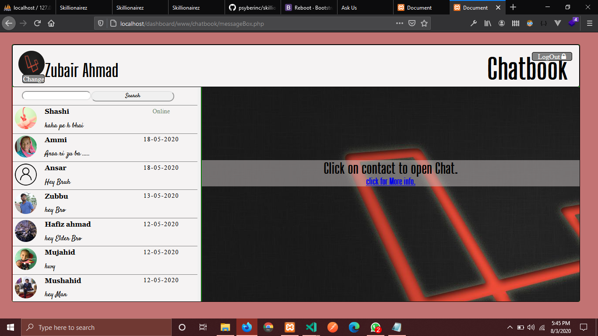

<h3>Single page Application (SPA) using core Js And Core PHP </h3>

<h4>Home Page</h4>

<h4>Cool and Responsive Chating page</h4>

<h4>Auto adjustable Input Field</h4>

<h4>Users search feature by mobile Number</h4>

<h4>Search users by Name</h4>

<h4>Open image (Show Image)</h4>

